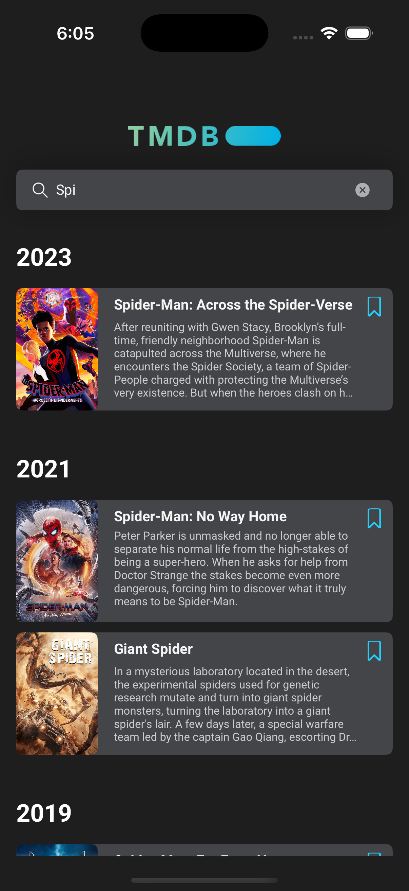
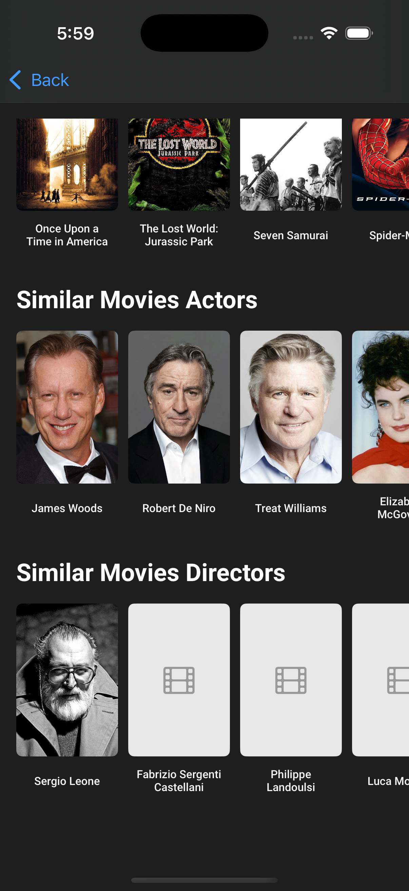

# tmdb
Discover popular movies and search for your favorite titles with the TMDB iOS app. View detailed movie information, including overviews, release dates, and images, and easily add movies to your watchlist for later viewing. A simple, intuitive app to enhance your movie experience.

## Screenshots

 | |
---------------------------|---------------------------|-------------------------
 | |

## Installation

Run `sudo gem install cocoapods`

Run `pod install`

Open the project from `.xcworkspace` file

Replace `ACCESS_TOKEN` and `API_KEY` with your own through themoviedb.org
NOTE: Placing such secrets in Info.Plist is not a production practice,
this is for the sake of simplicty. Also Avoid commiting any secrets on git.

## Technical Stack:

**RxSwift and RxCocoa**: Leverage reactive programming for responsive and fluid UI interactions.

**Promise Kit**: Handle asynchronous tasks efficiently with concise syntax.

**Programmatic UI**: Build dynamic and custom UIs for a tailored experience.

**Clean Architecture**: Maintain a well-organized codebase for improved maintainability and scalability.

**MVVM Pattern**: Separate business logic from presentation for clearer code and easier testing.

**Coordinator, Factory, Delegate Patterns, and more**: Utilize advanced design patterns for modularity and efficient communication between components.

## TODO:
- Unit Testing